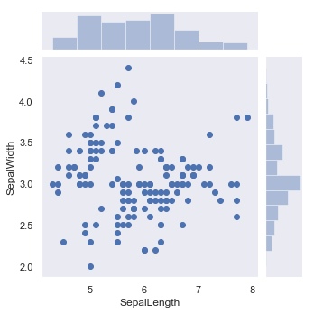
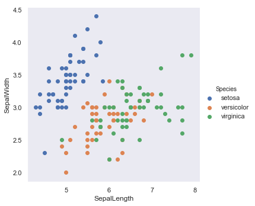
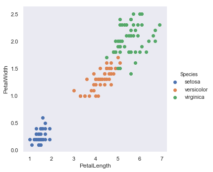
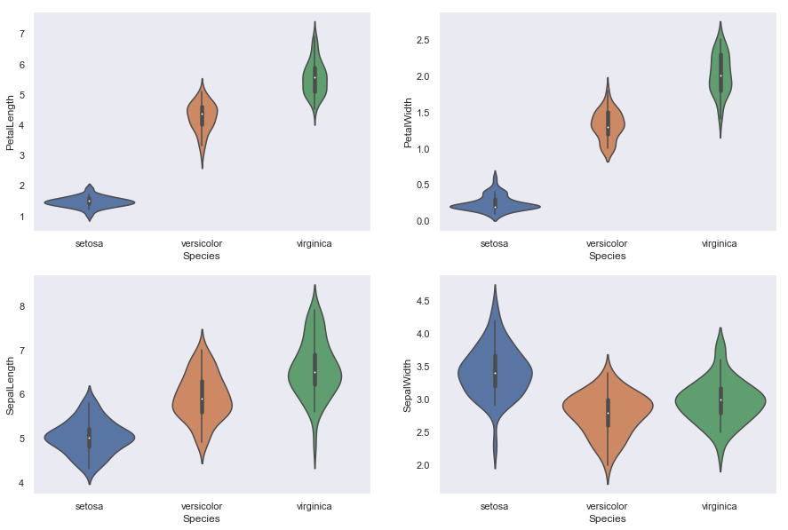
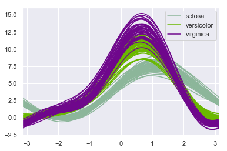
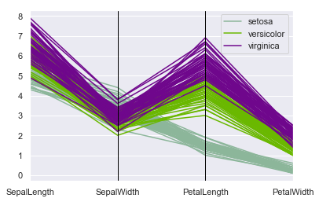
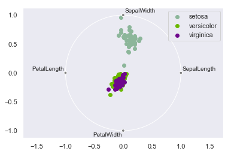
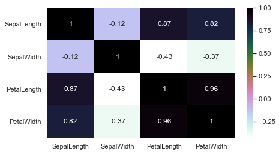
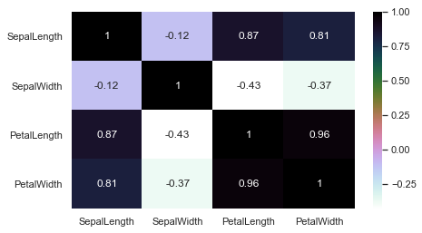

<h1>Code4Life academy recrutation - Iris Dataset

<h2> Basic import, data import, cleaning & data preparing</h2>

Let start with some necessery imports 


```python
import numpy as np
import pandas as pd
import seaborn as sns
import matplotlib.pyplot as plt

from pandas.plotting import andrews_curves, parallel_coordinates, radviz
```


```python
import warnings
warnings.filterwarnings("ignore")
```


```python
sns.set(style="dark", color_codes=True)
```

After some imports and config we can start with reading data; take a look into a file:

"Sepal.Length"|"Sepal.Width"|"Petal.Length"|"Petal.Width"|"Species"  
"1"|5.1|3.5|1.4|"0.2"|"setosa"  
"2"|4.9|3|1.4|"0.2"|"setosa"

As we can see, delimiter is "|", not ","; as we can also see - we have a header line in file, so using 
>pd.read_csv

will read it  - or we can use 'header' parameter to define it manually.


```python
data = pd.read_csv('../data/raw/iris_dataset.csv', delimiter="|")
```


```python
data.head()
```


<div>
<style scoped>
    .dataframe tbody tr th:only-of-type {
        vertical-align: middle;
    }

    .dataframe tbody tr th {
        vertical-align: top;
    }

    .dataframe thead th {
        text-align: right;
    }
</style>
<table border="1" class="dataframe">
  <thead>
    <tr style="text-align: right;">
      <th></th>
      <th>Sepal.Length</th>
      <th>Sepal.Width</th>
      <th>Petal.Length</th>
      <th>Petal.Width</th>
      <th>Species</th>
    </tr>
  </thead>
  <tbody>
    <tr>
      <th>1</th>
      <td>5.1</td>
      <td>3.5</td>
      <td>1.4</td>
      <td>0.2</td>
      <td>setosa</td>
    </tr>
    <tr>
      <th>2</th>
      <td>4.9</td>
      <td>3.0</td>
      <td>1.4</td>
      <td>0.2</td>
      <td>setosa</td>
    </tr>
    <tr>
      <th>3</th>
      <td>4.7</td>
      <td>3.2</td>
      <td>1.3</td>
      <td>0.2</td>
      <td>setosa</td>
    </tr>
    <tr>
      <th>4</th>
      <td>4.6</td>
      <td>3.1</td>
      <td>1.5</td>
      <td>0.2</td>
      <td>setosa</td>
    </tr>
    <tr>
      <th>5</th>
      <td>5.0</td>
      <td>3.6</td>
      <td>1.4</td>
      <td>0.2</td>
      <td>setosa</td>
    </tr>
  </tbody>
</table>
</div>


```python
data.describe()
```


<div>
<style scoped>
    .dataframe tbody tr th:only-of-type {
        vertical-align: middle;
    }

    .dataframe tbody tr th {
        vertical-align: top;
    }

    .dataframe thead th {
        text-align: right;
    }
</style>
<table border="1" class="dataframe">
  <thead>
    <tr style="text-align: right;">
      <th></th>
      <th>Sepal.Length</th>
      <th>Sepal.Width</th>
      <th>Petal.Length</th>
    </tr>
  </thead>
  <tbody>
    <tr>
      <th>count</th>
      <td>150.000000</td>
      <td>149.000000</td>
      <td>150.000000</td>
    </tr>
    <tr>
      <th>mean</th>
      <td>5.779333</td>
      <td>3.061745</td>
      <td>3.758000</td>
    </tr>
    <tr>
      <th>std</th>
      <td>1.197721</td>
      <td>0.433963</td>
      <td>1.765298</td>
    </tr>
    <tr>
      <th>min</th>
      <td>-4.800000</td>
      <td>2.000000</td>
      <td>1.000000</td>
    </tr>
    <tr>
      <th>25%</th>
      <td>5.100000</td>
      <td>2.800000</td>
      <td>1.600000</td>
    </tr>
    <tr>
      <th>50%</th>
      <td>5.800000</td>
      <td>3.000000</td>
      <td>4.350000</td>
    </tr>
    <tr>
      <th>75%</th>
      <td>6.400000</td>
      <td>3.300000</td>
      <td>5.100000</td>
    </tr>
    <tr>
      <th>max</th>
      <td>7.900000</td>
      <td>4.400000</td>
      <td>6.900000</td>
    </tr>
  </tbody>
</table>
</div>


So, before we start working with data - we should work on a copy of data


```python
data_copy = data.copy()
data_copy.columns = ['SepalLength', 'SepalWidth', 'PetalLength', 'PetalWidth',
       'Species']
data_copy.describe()
```


<div>
<style scoped>
    .dataframe tbody tr th:only-of-type {
        vertical-align: middle;
    }

    .dataframe tbody tr th {
        vertical-align: top;
    }

    .dataframe thead th {
        text-align: right;
    }
</style>
<table border="1" class="dataframe">
  <thead>
    <tr style="text-align: right;">
      <th></th>
      <th>SepalLength</th>
      <th>SepalWidth</th>
      <th>PetalLength</th>
    </tr>
  </thead>
  <tbody>
    <tr>
      <th>count</th>
      <td>150.000000</td>
      <td>149.000000</td>
      <td>150.000000</td>
    </tr>
    <tr>
      <th>mean</th>
      <td>5.779333</td>
      <td>3.061745</td>
      <td>3.758000</td>
    </tr>
    <tr>
      <th>std</th>
      <td>1.197721</td>
      <td>0.433963</td>
      <td>1.765298</td>
    </tr>
    <tr>
      <th>min</th>
      <td>-4.800000</td>
      <td>2.000000</td>
      <td>1.000000</td>
    </tr>
    <tr>
      <th>25%</th>
      <td>5.100000</td>
      <td>2.800000</td>
      <td>1.600000</td>
    </tr>
    <tr>
      <th>50%</th>
      <td>5.800000</td>
      <td>3.000000</td>
      <td>4.350000</td>
    </tr>
    <tr>
      <th>75%</th>
      <td>6.400000</td>
      <td>3.300000</td>
      <td>5.100000</td>
    </tr>
    <tr>
      <th>max</th>
      <td>7.900000</td>
      <td>4.400000</td>
      <td>6.900000</td>
    </tr>
  </tbody>
</table>
</div>


```python
null_columns=data_copy.columns[data_copy.isnull().any()]
data_copy[null_columns].isnull().sum()
```


    SepalWidth    1
    dtype: int64


Ooops, as we see there - there is one value missing in Sepal.width - we have to handle it before we can start working with data.  
As we can also see - one column in not included in this summary.


```python
print(data_copy[data_copy.isnull().any(axis=1)][null_columns].head())
```

        SepalWidth
    82         NaN
    

So at row number 82 we have missing value - let's check it also on file, if there is problem with reading data, or value is really missing - in this case we can handle it, because it's only one value.
>"82"|5.5|NA|3.7|"1"|"versicolor"  

So we have there missing value. Another interesting thing - we have an quotation mark at index and one column - let's check these one column, what was not included in summary of data.


```python
print(data_copy['PetalWidth'].value_counts())
```

    0.2    29
    1.3    13
    1.8    12
    1.5    12
    2.3     8
    1.4     8
    0.3     7
    1       7
    0.4     7
    2.1     6
    2       6
    0.1     5
    1.2     5
    1.9     5
    1.6     4
    1.1     3
    2.5     3
    2.4     3
    1.7     2
    2.2     2
    0.6     1
    0.5     1
    2,2     1
    Name: PetalWidth, dtype: int64
    


```python
print(data_copy.dtypes)
```

    SepalLength    float64
    SepalWidth     float64
    PetalLength    float64
    PetalWidth      object
    Species         object
    dtype: object
    

As we can see, one value has ",", the remaining values have a dot between numbers - let handle it now. And these values are now stored as a string (object type)!


```python
data_copy['PetalWidth'] = data_copy['PetalWidth'].apply(lambda x: x.replace(',','.'))
```


```python
print(data_copy['PetalWidth'].value_counts())
```

    0.2    29
    1.3    13
    1.8    12
    1.5    12
    1.4     8
    2.3     8
    0.3     7
    1       7
    0.4     7
    2.1     6
    2       6
    0.1     5
    1.2     5
    1.9     5
    1.6     4
    2.4     3
    2.5     3
    2.2     3
    1.1     3
    1.7     2
    0.6     1
    0.5     1
    Name: PetalWidth, dtype: int64
    

We can now convert into float values column


```python
data_copy['PetalWidth'] = data_copy['PetalWidth'].astype(float)
data_copy.describe()
```


<div>
<style scoped>
    .dataframe tbody tr th:only-of-type {
        vertical-align: middle;
    }

    .dataframe tbody tr th {
        vertical-align: top;
    }

    .dataframe thead th {
        text-align: right;
    }
</style>
<table border="1" class="dataframe">
  <thead>
    <tr style="text-align: right;">
      <th></th>
      <th>SepalLength</th>
      <th>SepalWidth</th>
      <th>PetalLength</th>
      <th>PetalWidth</th>
    </tr>
  </thead>
  <tbody>
    <tr>
      <th>count</th>
      <td>150.000000</td>
      <td>149.000000</td>
      <td>150.000000</td>
      <td>150.000000</td>
    </tr>
    <tr>
      <th>mean</th>
      <td>5.779333</td>
      <td>3.061745</td>
      <td>3.758000</td>
      <td>1.199333</td>
    </tr>
    <tr>
      <th>std</th>
      <td>1.197721</td>
      <td>0.433963</td>
      <td>1.765298</td>
      <td>0.762238</td>
    </tr>
    <tr>
      <th>min</th>
      <td>-4.800000</td>
      <td>2.000000</td>
      <td>1.000000</td>
      <td>0.100000</td>
    </tr>
    <tr>
      <th>25%</th>
      <td>5.100000</td>
      <td>2.800000</td>
      <td>1.600000</td>
      <td>0.300000</td>
    </tr>
    <tr>
      <th>50%</th>
      <td>5.800000</td>
      <td>3.000000</td>
      <td>4.350000</td>
      <td>1.300000</td>
    </tr>
    <tr>
      <th>75%</th>
      <td>6.400000</td>
      <td>3.300000</td>
      <td>5.100000</td>
      <td>1.800000</td>
    </tr>
    <tr>
      <th>max</th>
      <td>7.900000</td>
      <td>4.400000</td>
      <td>6.900000</td>
      <td>2.500000</td>
    </tr>
  </tbody>
</table>
</div>


```python
data_copy.dtypes
```


    SepalLength    float64
    SepalWidth     float64
    PetalLength    float64
    PetalWidth     float64
    Species         object
    dtype: object


One column less - let's check other, if they do not contain something bad

Looking almost good, but.. values in these columns cannot be below 0! So, we have one 
> -4.8  

value at Sepal.Length column. We should now ask experts/client about it - because we have three options now:
* to remove row (but we have small dataset - but this way will prevent us from distortion of data)
* to replace negative value with abs values (if it fits to other values (probably from their category) - is between min and max of other samples)
* or just use mean value - from whole column - or just from this category

so at this place - we should handle it with one of possible ways. Or maybe we should try every possible solution. We should also try this for missing value Sepal.Width.  
But this time, we will try with two possible solutions:
* one, with dropping row with missing/incorrect values
* second, with using mean value from category for missing/incorrect values

<h3> Handling missing/incorrect values </h3>


```python
test_data_dropped = data_copy.copy()
test_data_dropped = test_data_dropped[test_data_dropped['SepalLength'] > 0]
test_data_dropped= test_data_dropped.dropna(axis=0, how='any', thresh=None, subset=None, inplace=False)
test_data_dropped.describe()
```


<div>
<style scoped>
    .dataframe tbody tr th:only-of-type {
        vertical-align: middle;
    }

    .dataframe tbody tr th {
        vertical-align: top;
    }

    .dataframe thead th {
        text-align: right;
    }
</style>
<table border="1" class="dataframe">
  <thead>
    <tr style="text-align: right;">
      <th></th>
      <th>SepalLength</th>
      <th>SepalWidth</th>
      <th>PetalLength</th>
      <th>PetalWidth</th>
    </tr>
  </thead>
  <tbody>
    <tr>
      <th>count</th>
      <td>148.000000</td>
      <td>148.000000</td>
      <td>148.000000</td>
      <td>148.000000</td>
    </tr>
    <tr>
      <th>mean</th>
      <td>5.852703</td>
      <td>3.059459</td>
      <td>3.770946</td>
      <td>1.207432</td>
    </tr>
    <tr>
      <th>std</th>
      <td>0.828690</td>
      <td>0.434536</td>
      <td>1.770593</td>
      <td>0.762746</td>
    </tr>
    <tr>
      <th>min</th>
      <td>4.300000</td>
      <td>2.000000</td>
      <td>1.000000</td>
      <td>0.100000</td>
    </tr>
    <tr>
      <th>25%</th>
      <td>5.100000</td>
      <td>2.800000</td>
      <td>1.575000</td>
      <td>0.300000</td>
    </tr>
    <tr>
      <th>50%</th>
      <td>5.800000</td>
      <td>3.000000</td>
      <td>4.400000</td>
      <td>1.300000</td>
    </tr>
    <tr>
      <th>75%</th>
      <td>6.400000</td>
      <td>3.300000</td>
      <td>5.100000</td>
      <td>1.800000</td>
    </tr>
    <tr>
      <th>max</th>
      <td>7.900000</td>
      <td>4.400000</td>
      <td>6.900000</td>
      <td>2.500000</td>
    </tr>
  </tbody>
</table>
</div>


```python
test_data_mean = data_copy.copy()
test_data_mean = test_data_mean.assign(b = test_data_mean['SepalLength'].where(test_data_mean['SepalLength'].ge(0)))
test_data_mean['SepalLength'] = test_data_mean['b']
test_data_mean = test_data_mean.drop(columns='b')
test_data_mean = test_data_mean.fillna(test_data_mean.mean())
test_data_mean.describe()
```


<div>
<style scoped>
    .dataframe tbody tr th:only-of-type {
        vertical-align: middle;
    }

    .dataframe tbody tr th {
        vertical-align: top;
    }

    .dataframe thead th {
        text-align: right;
    }
</style>
<table border="1" class="dataframe">
  <thead>
    <tr style="text-align: right;">
      <th></th>
      <th>SepalLength</th>
      <th>SepalWidth</th>
      <th>PetalLength</th>
      <th>PetalWidth</th>
    </tr>
  </thead>
  <tbody>
    <tr>
      <th>count</th>
      <td>150.000000</td>
      <td>150.000000</td>
      <td>150.000000</td>
      <td>150.000000</td>
    </tr>
    <tr>
      <th>mean</th>
      <td>5.850336</td>
      <td>3.061745</td>
      <td>3.758000</td>
      <td>1.199333</td>
    </tr>
    <tr>
      <th>std</th>
      <td>0.823613</td>
      <td>0.432504</td>
      <td>1.765298</td>
      <td>0.762238</td>
    </tr>
    <tr>
      <th>min</th>
      <td>4.300000</td>
      <td>2.000000</td>
      <td>1.000000</td>
      <td>0.100000</td>
    </tr>
    <tr>
      <th>25%</th>
      <td>5.100000</td>
      <td>2.800000</td>
      <td>1.600000</td>
      <td>0.300000</td>
    </tr>
    <tr>
      <th>50%</th>
      <td>5.800000</td>
      <td>3.000000</td>
      <td>4.350000</td>
      <td>1.300000</td>
    </tr>
    <tr>
      <th>75%</th>
      <td>6.400000</td>
      <td>3.300000</td>
      <td>5.100000</td>
      <td>1.800000</td>
    </tr>
    <tr>
      <th>max</th>
      <td>7.900000</td>
      <td>4.400000</td>
      <td>6.900000</td>
      <td>2.500000</td>
    </tr>
  </tbody>
</table>
</div>


We have a preview of data - let's check how many of samples in each specie we have for each frame:


```python
test_data_mean["Species"].value_counts()
```


    setosa        50
    virginica     50
    versicolor    50
    Name: Species, dtype: int64


```python
test_data_dropped["Species"].value_counts()
```


    virginica     50
    setosa        49
    versicolor    49
    Name: Species, dtype: int64


<h2> Data exploring - visualization, getting some knowledge about data </h2>

Let's visualize our data - starting with scatterplot - using test_data_mean dataframe
First, start with Sepal length x width columns


```python
plot = sns.jointplot(x="SepalLength", y="SepalWidth", data=test_data_mean, size=5)
plot.savefig('../reports/figures/scatter_sepal.png')
```





But from these one - we don't know, to which category belong specified sample


```python
plot = sns.FacetGrid(test_data_mean, hue="Species", size=5).map(plt.scatter, "SepalLength", "SepalWidth").add_legend()
plot.savefig('../reports/figures/scatter_sepal_legend.png')
```





As we see there - there is one outline in setosa, and versicolor and viriginica are mixed - but virginica has bigger values of length than versicolor. Take also a look into petal length and width.


```python
plot = sns.FacetGrid(test_data_mean, hue="Species", size=5).map(plt.scatter, "PetalLength", "PetalWidth").add_legend()
plot.savefig('../reports/figures/scatter_petal_legend.png')
```





This time we see that setosa is isolated, without outlines, and two remaining has area with mixed samples - but we see, that most of them are there more isolated. That plot give us more information about data correlation to specified species. 

Lets look into density of variables


```python
plt.figure(figsize=(15,10))
plt.subplot(2,2,1)
sns.violinplot(x='Species',y='PetalLength',data=test_data_mean)
plt.subplot(2,2,2)
sns.violinplot(x='Species',y='PetalWidth',data=test_data_mean)
plt.subplot(2,2,3)
sns.violinplot(x='Species',y='SepalLength',data=test_data_mean)
plt.subplot(2,2,4)
sns.violinplot(x='Species',y='SepalWidth',data=test_data_mean)
plt.savefig('../reports/figures/violin_all.png')
```





As we can see on previous plot, Petal width & length has great impact on class - their values are totally separeted from each other and in prediction will have significant impact. Problem is with sepal length and width - data overlap in both of them, but their core parts are on another values - but not at width, because versicolor and virignica has core values on same level.

Scatterplot is great, but we have to look deeper and work with our Curse of Dimensionality. More dimenstions - to work with that, we can use Andrews' Curves, where the observation represents the coefficients of a so-called Fourier series. We can also use Parallel Coordinates plot, which shows values of all features in one plot - with using separate columns for each. Last one of this plots is radviz, which plots a N-dimensional data set into a simple 2D space where the influence of each dimension can be interpreted as a balance between the influence of all dimensions.


```python
plot = andrews_curves(test_data_mean, "Species")
plot.figure.savefig('../reports/figures/andrew_curves.png')
```





```python
plot = parallel_coordinates(test_data_mean, "Species")
plot.figure.savefig('../reports/figures/parallel_coordinates.png')
```





```python
radviz(test_data_mean, "Species")
plot.figure.savefig('../reports/figures/radviz.png')
```


After analyse of radviz plot - we see that there can be classification error with versicolor and virginica samples.

Let's take a look into second data frame - with dropping missing/incomplete rows. I will focus on two most giving information graphs - radviz and parallel.


```python
parallel_coordinates(test_data_dropped, "Species")
plot.figure.savefig('../reports/figures/parallel_coordinates_dropped.png')
```


```python
radviz(test_data_dropped, "Species")
plot.figure.savefig('../reports/figures/radviz_dropped.png')
```





... and dropping these two rows do not change plots so much - but we should go further and analyse correlation between attributes and target feature

<h3> Pearson correlation check </h3>


```python
test_data_dropped.corr()
```


<div>
<style scoped>
    .dataframe tbody tr th:only-of-type {
        vertical-align: middle;
    }

    .dataframe tbody tr th {
        vertical-align: top;
    }

    .dataframe thead th {
        text-align: right;
    }
</style>
<table border="1" class="dataframe">
  <thead>
    <tr style="text-align: right;">
      <th></th>
      <th>Sepal.Length</th>
      <th>Sepal.Width</th>
      <th>Petal.Length</th>
      <th>Petal.Width</th>
    </tr>
  </thead>
  <tbody>
    <tr>
      <th>Sepal.Length</th>
      <td>1.000000</td>
      <td>-0.117009</td>
      <td>0.871145</td>
      <td>0.815815</td>
    </tr>
    <tr>
      <th>Sepal.Width</th>
      <td>-0.117009</td>
      <td>1.000000</td>
      <td>-0.429040</td>
      <td>-0.367709</td>
    </tr>
    <tr>
      <th>Petal.Length</th>
      <td>0.871145</td>
      <td>-0.429040</td>
      <td>1.000000</td>
      <td>0.962910</td>
    </tr>
    <tr>
      <th>Petal.Width</th>
      <td>0.815815</td>
      <td>-0.367709</td>
      <td>0.962910</td>
      <td>1.000000</td>
    </tr>
  </tbody>
</table>
</div>


```python
test_data_mean.corr()
```


<div>
<style scoped>
    .dataframe tbody tr th:only-of-type {
        vertical-align: middle;
    }

    .dataframe tbody tr th {
        vertical-align: top;
    }

    .dataframe thead th {
        text-align: right;
    }
</style>
<table border="1" class="dataframe">
  <thead>
    <tr style="text-align: right;">
      <th></th>
      <th>Sepal.Length</th>
      <th>Sepal.Width</th>
      <th>Petal.Length</th>
      <th>Petal.Width</th>
    </tr>
  </thead>
  <tbody>
    <tr>
      <th>Sepal.Length</th>
      <td>1.000000</td>
      <td>-0.116711</td>
      <td>0.867459</td>
      <td>0.811142</td>
    </tr>
    <tr>
      <th>Sepal.Width</th>
      <td>-0.116711</td>
      <td>1.000000</td>
      <td>-0.432108</td>
      <td>-0.371657</td>
    </tr>
    <tr>
      <th>Petal.Length</th>
      <td>0.867459</td>
      <td>-0.432108</td>
      <td>1.000000</td>
      <td>0.962865</td>
    </tr>
    <tr>
      <th>Petal.Width</th>
      <td>0.811142</td>
      <td>-0.371657</td>
      <td>0.962865</td>
      <td>1.000000</td>
    </tr>
  </tbody>
</table>
</div>


```python
plt.figure(figsize=(7,4)) 
plot = sns.heatmap(test_data_dropped.corr(),annot=True,cmap='cubehelix_r')
plot.figure.savefig('../reports/figures/heatmap_corr_dropped.png')
```





```python
plt.figure(figsize=(7,4)) 
plot = sns.heatmap(test_data_mean.corr(),annot=True,cmap='cubehelix_r')
plot.figure.savefig('../reports/figures/heatmap_corr_mean.png')
```





After looking at heatmap - diffrence between two methods are really small only correlation between petal width and sepal length changed.  
The SepalWidth and SepalLength has realy low correlation/no correlation.  
The PetalWidth and PetalLength are highly correlated  

But first - lets check values of correlation of each feature to target feature. To do that, we have to encode category - or use one-way anova test.

<h3> Checking correlation between features and target </h3>

<h4> Using statistic tests </h4>


```python
import scipy.stats as stats
from statsmodels.formula.api import ols
```


```python
test_data_mean.columns
```


    Index(['SepalLength', 'SepalWidth', 'PetalLength', 'PetalWidth', 'Species'], dtype='object')


```python
stats.f_oneway(test_data_mean['PetalLength'][test_data_mean['Species'] == 'setosa'], 
             test_data_mean['PetalLength'][test_data_mean['Species'] == 'versicolor'],
             test_data_mean['PetalLength'][test_data_mean['Species'] == 'virginica'])
```


    F_onewayResult(statistic=1180.161182252981, pvalue=2.8567766109615584e-91)


```python
results = ols('PetalLength ~ C(Species)', data=test_data_mean).fit()
results.summary()
```


<table class="simpletable">
<caption>OLS Regression Results</caption>
<tr>
  <th>Dep. Variable:</th>       <td>PetalLength</td>   <th>  R-squared:         </th> <td>   0.941</td>
</tr>
<tr>
  <th>Model:</th>                   <td>OLS</td>       <th>  Adj. R-squared:    </th> <td>   0.941</td>
</tr>
<tr>
  <th>Method:</th>             <td>Least Squares</td>  <th>  F-statistic:       </th> <td>   1180.</td>
</tr>
<tr>
  <th>Date:</th>             <td>Fri, 14 Jun 2019</td> <th>  Prob (F-statistic):</th> <td>2.86e-91</td>
</tr>
<tr>
  <th>Time:</th>                 <td>10:53:12</td>     <th>  Log-Likelihood:    </th> <td> -84.847</td>
</tr>
<tr>
  <th>No. Observations:</th>      <td>   150</td>      <th>  AIC:               </th> <td>   175.7</td>
</tr>
<tr>
  <th>Df Residuals:</th>          <td>   147</td>      <th>  BIC:               </th> <td>   184.7</td>
</tr>
<tr>
  <th>Df Model:</th>              <td>     2</td>      <th>                     </th>     <td> </td>   
</tr>
<tr>
  <th>Covariance Type:</th>      <td>nonrobust</td>    <th>                     </th>     <td> </td>   
</tr>
</table>
<table class="simpletable">
<tr>
              <td></td>                <th>coef</th>     <th>std err</th>      <th>t</th>      <th>P>|t|</th>  <th>[0.025</th>    <th>0.975]</th>  
</tr>
<tr>
  <th>Intercept</th>                <td>    1.4620</td> <td>    0.061</td> <td>   24.023</td> <td> 0.000</td> <td>    1.342</td> <td>    1.582</td>
</tr>
<tr>
  <th>C(Species)[T.versicolor]</th> <td>    2.7980</td> <td>    0.086</td> <td>   32.510</td> <td> 0.000</td> <td>    2.628</td> <td>    2.968</td>
</tr>
<tr>
  <th>C(Species)[T.virginica]</th>  <td>    4.0900</td> <td>    0.086</td> <td>   47.521</td> <td> 0.000</td> <td>    3.920</td> <td>    4.260</td>
</tr>
</table>
<table class="simpletable">
<tr>
  <th>Omnibus:</th>       <td> 4.394</td> <th>  Durbin-Watson:     </th> <td>   1.997</td>
</tr>
<tr>
  <th>Prob(Omnibus):</th> <td> 0.111</td> <th>  Jarque-Bera (JB):  </th> <td>   5.366</td>
</tr>
<tr>
  <th>Skew:</th>          <td> 0.122</td> <th>  Prob(JB):          </th> <td>  0.0683</td>
</tr>
<tr>
  <th>Kurtosis:</th>      <td> 3.894</td> <th>  Cond. No.          </th> <td>    3.73</td>
</tr>
</table><br/><br/>Warnings:<br/>[1] Standard Errors assume that the covariance matrix of the errors is correctly specified.


let's interprate tests - we got this values:
* p-value: 2.86e-91
* f-stat: 1180

so we can interprate this value as a high correlation. Continue with other features.


```python
stats.f_oneway(test_data_mean['PetalWidth'][test_data_mean['Species'] == 'setosa'], 
             test_data_mean['PetalWidth'][test_data_mean['Species'] == 'versicolor'],
             test_data_mean['PetalWidth'][test_data_mean['Species'] == 'virginica'])
```


    F_onewayResult(statistic=960.007146801809, pvalue=4.169445839443116e-85)


```python
stats.f_oneway(test_data_mean['SepalLength'][test_data_mean['Species'] == 'setosa'], 
             test_data_mean['SepalLength'][test_data_mean['Species'] == 'versicolor'],
             test_data_mean['SepalLength'][test_data_mean['Species'] == 'virginica'])
```


    F_onewayResult(statistic=114.07485381664135, pvalue=1.241038052658806e-30)


```python
stats.f_oneway(test_data_mean['SepalWidth'][test_data_mean['Species'] == 'setosa'], 
             test_data_mean['SepalWidth'][test_data_mean['Species'] == 'versicolor'],
             test_data_mean['SepalWidth'][test_data_mean['Species'] == 'virginica'])
```


    F_onewayResult(statistic=47.70777835913615, pvalue=1.0780237566238808e-16)


What we can see there? As we see there, some of values are more, some are less significant for target feature - but as we can see, every has some impact. I want also to know the pearson correlation between them - in that case, i have to encode categorical values as numbers.

<h4> Using category encoding </h4>


```python
from sklearn import preprocessing
```


```python
le = preprocessing.LabelEncoder()
le.fit(data_copy['Species'])
le.classes_
```


    array(['setosa', 'versicolor', 'virginica'], dtype=object)


```python
test_data_mean['SpeciesEncoded'] = le.transform(test_data_mean['Species'])
test_data_mean['SpeciesEncoded'].unique()
```


    array([0, 1, 2], dtype=int64)


```python
test_data_mean.corr()['SpeciesEncoded']
```


    SepalLength       0.776345
    SepalWidth       -0.429974
    PetalLength       0.949035
    PetalWidth        0.956547
    SpeciesEncoded    1.000000
    Name: SpeciesEncoded, dtype: float64


Let's do it also for second frame


```python
test_data_dropped['SpeciesEncoded'] = le.transform(test_data_dropped['Species'])
test_data_mean['SpeciesEncoded'].unique()
```


    array([0, 1, 2], dtype=int64)


```python
test_data_dropped.corr()['SpeciesEncoded']
```


    SepalLength       0.780736
    SepalWidth       -0.426554
    PetalLength       0.948684
    PetalWidth        0.956323
    SpeciesEncoded    1.000000
    Name: SpeciesEncoded, dtype: float64


As we see there, we have some differences - but as we can see, using mean  instead of dropping we have higher correlation between SepalLength and Species, like also for SepalWidth. For next steps we should experiment with using features - should we use all features to build model, or use only these with higher correlation?

<h2> Models preparation </h2>


```python
#we should now drop these additional columns
if 'SpeciesEncoded' in test_data_dropped.columns:
    test_data_dropped = test_data_dropped.drop(columns=['SpeciesEncoded'])
if 'SpeciesEncoded' in test_data_mean.columns:
    test_data_mean = test_data_mean.drop(columns=['SpeciesEncoded'])
```

After exploring and clearing it's time to start working on a model(s)


```python
from sklearn.model_selection import train_test_split
from sklearn import metrics
```


```python
from sklearn.neighbors import KNeighborsClassifier  
from sklearn.svm import SVC
from sklearn.tree import DecisionTreeClassifier
```

After importing most important elements for now, we should split our datasets(frames) to train part (70% of data) and test data (30% of data)


```python
seed = 7 #if we want to reproduce same data each time - use random state seed
```


```python
train_dropped, test_dropped = train_test_split(test_data_dropped, test_size = 0.3, random_state=seed)
```


```python
train_dropped.shape
```


    (103, 5)


```python
test_dropped.shape #looking fine
```


    (45, 5)


```python
train_mean, test_mean  = train_test_split(test_data_mean, test_size = 0.3, random_state=seed)
```


```python
train_mean.shape
```


    (105, 5)


```python
test_mean.shape #also looking fine
```


    (45, 5)


<h3> Model building using all features </h3>

Now - split it into feature and target feature both for test and training


```python
data_features = ['SepalLength', 'SepalWidth', 'PetalLength', 'PetalWidth']
```


```python
train_dropped_X = train_dropped[data_features] # taking the training data features
train_dropped_y=train_dropped.Species # output of our training data
test_dropped_X= test_dropped[data_features] # taking test data features
test_dropped_y =test_dropped.Species   #output value of test data
```


```python
train_mean_X = train_mean[data_features] # taking the training data features
train_mean_y=train_mean.Species # output of our training data
test_mean_X= test_mean[data_features] # taking test data features
test_mean_y =test_mean.Species   #output value of test data
```


```python
import pickle #good practice is to save your models - let's save each model
import datetime
```


```python
#function to save model
default_path = '../models/'
def save_model(file_name, model):
    file_name = default_path + file_name + '.sav'
    pickle.dump(model, open(file_name, 'wb'))

def metrics_print(prediction, test_y):
    print('The accuracy is',metrics.accuracy_score(prediction,test_y))
    print('The precision is',metrics.precision_score(prediction,test_y, average=None)) 
    #averaege value: normally it's binary mode, but we have more than one class, so we have to use average=None - will return the precision scores for each class, 
    # or average=micro to return the total ratio of tp/(tp + fp)
    print('The recall is',metrics.recall_score(prediction,test_y, average=None))
    #The F1 score can be interpreted as a weighted average of the precision and recall, 
    #where an F1 score reaches its best value at 1 and worst score at 0. The relative contribution of precision and recall to the F1 score are equal.
    print('The F-score is', metrics.f1_score(prediction, test_y, average=None))
```

<h4>1. Model: KNN; DataFrame: test_dropped </h4>


```python
def knn(train_X, train_y, test_X, test_y, n_number = 3):
    model=KNeighborsClassifier(n_neighbors=n_number)
    model.fit(train_X,train_y)
    prediction=model.predict(test_X)
    metrics_print(prediction, test_y)
    save_model('knn_N-' + str(n_number) 
               + '_F1-' + str(round(metrics.f1_score(prediction, test_y, average='micro'), 3)).replace(".", ",") 
               + '_Acc-' + str(round(metrics.accuracy_score(prediction,test_y),3)).replace(".", ","), model)
```


```python
#3 neighbors
knn(train_dropped_X, train_dropped_y, test_dropped_X, test_dropped_y, 3)
```

    The accuracy is 0.9555555555555556
    The precision is [1.         0.91666667 0.91666667]
    The recall is [1.         0.91666667 0.91666667]
    The F-score is [1.         0.91666667 0.91666667]
    


```python
#5 neighbors
knn(train_dropped_X, train_dropped_y, test_dropped_X, test_dropped_y, 5)
```

    The accuracy is 0.9777777777777777
    The precision is [1.         1.         0.91666667]
    The recall is [1.         0.92307692 1.        ]
    The F-score is [1.         0.96       0.95652174]
    


```python
#7 neighbors
knn(train_dropped_X, train_dropped_y, test_dropped_X, test_dropped_y, 7)
```

    The accuracy is 1.0
    The precision is [1. 1. 1.]
    The recall is [1. 1. 1.]
    The F-score is [1. 1. 1.]
    


```python
#11 neighbors
knn(train_dropped_X, train_dropped_y, test_dropped_X, test_dropped_y, 11)
```

    The accuracy is 0.9777777777777777
    The precision is [1.         0.91666667 1.        ]
    The recall is [1.         1.         0.92307692]
    The F-score is [1.         0.95652174 0.96      ]
    

As we can see, changing the number of neigbors parameter can change score - starting with 0.955 to 1.0 accuracy. But that only accuracy - we should take a look also into additional parameters of model - precision, recall.  
* precision is intuitively the ability of the classifier not to label as positive a sample that is negative.  
* recall is intuitively the ability of the classifier to find all the positive samples.

After looking into these two additional - we see, that for one class there are always score=1 in recall and precision, for other - it depends on number of neigbours.

<h4>2. Model: SVM; DataFrame: test_dropped </h4>


```python
def svm(train_X, train_y, test_X, test_y, kernel):
    model = SVC(kernel=kernel)
    model.fit(train_X,train_y)
    prediction=model.predict(test_X)
    metrics_print(prediction, test_y)
    save_model('svm_Kernel-' + kernel
               + '_F1-' + str(round(metrics.f1_score(prediction, test_y, average='micro'), 3)).replace(".", ",") 
               + '_Acc-' + str(round(metrics.accuracy_score(prediction,test_y),3)).replace(".", ","), model)
```


```python
#svm as a parameter takes kernel type
#It must be one of ‘linear’, ‘poly’, ‘rbf’, ‘sigmoid’, ‘precomputed’
svm(train_dropped_X, train_dropped_y, test_dropped_X, test_dropped_y, 'rbf')
```

    The accuracy is 0.9777777777777777
    The precision is [1.         0.91666667 1.        ]
    The recall is [1.         1.         0.92307692]
    The F-score is [1.         0.95652174 0.96      ]
    


```python
svm(train_dropped_X, train_dropped_y, test_dropped_X, test_dropped_y, 'linear')
```

    The accuracy is 0.9777777777777777
    The precision is [1.         0.91666667 1.        ]
    The recall is [1.         1.         0.92307692]
    The F-score is [1.         0.95652174 0.96      ]
    


```python
svm(train_dropped_X, train_dropped_y, test_dropped_X, test_dropped_y, 'poly')
```

    The accuracy is 0.9555555555555556
    The precision is [1.         0.91666667 0.91666667]
    The recall is [1.         0.91666667 0.91666667]
    The F-score is [1.         0.91666667 0.91666667]
    


```python
svm(train_dropped_X, train_dropped_y, test_dropped_X, test_dropped_y, 'sigmoid')
```

    The accuracy is 0.26666666666666666
    The precision is [0. 0. 1.]
    The recall is [0.         0.         0.26666667]
    The F-score is [0.         0.         0.42105263]
    

<h4>3. Model: DecisionTree; DataFrame: test_dropped </h4>

<h4>4. Model: KNN; DataFrame: test_mean </h4>

<h4>5. Model: SVM; DataFrame: test_mean </h4>

<h4>6. Model: DecisionTree; DataFrame: test_mean </h4>


```python

```


```python

```
